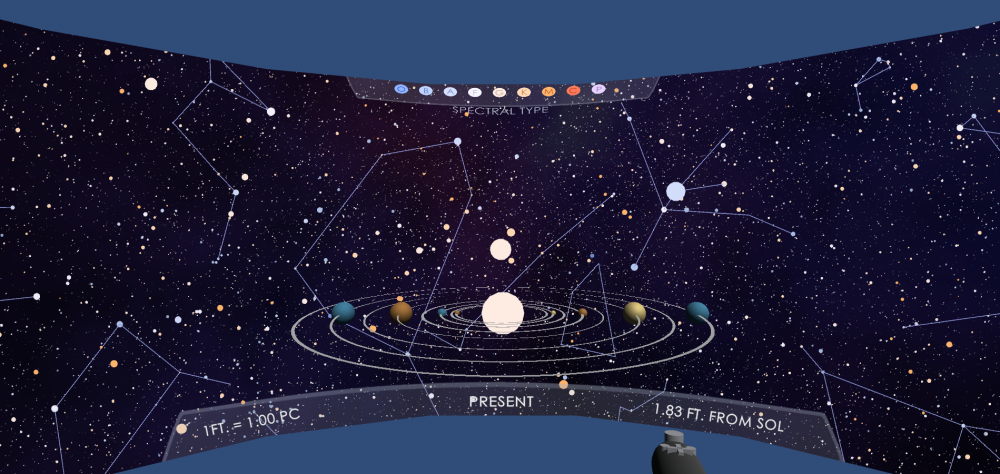
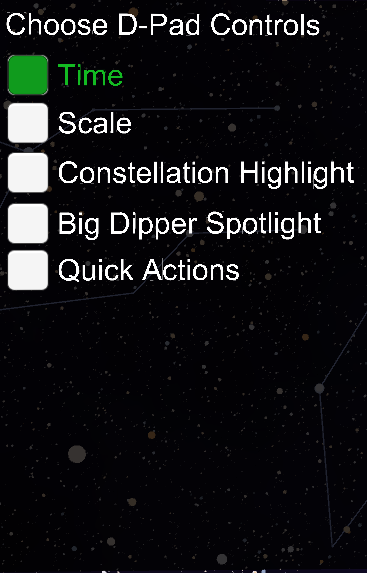
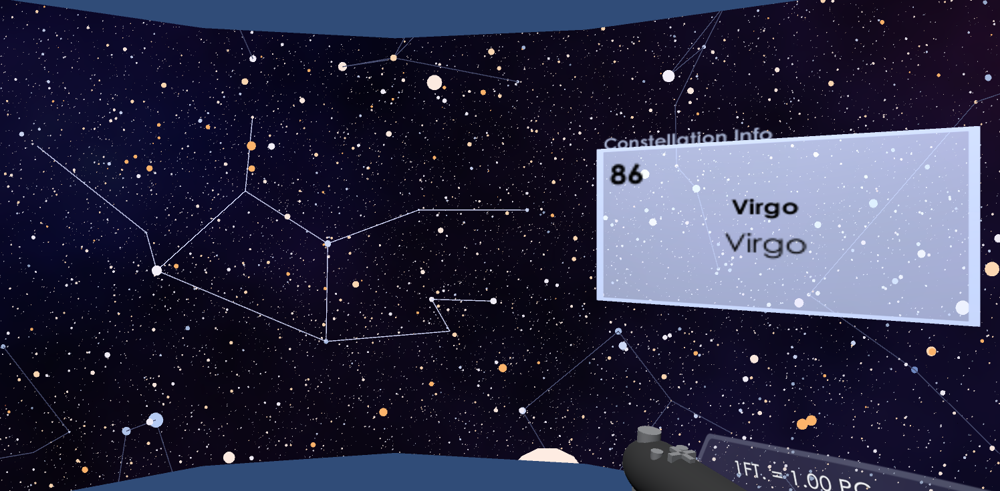
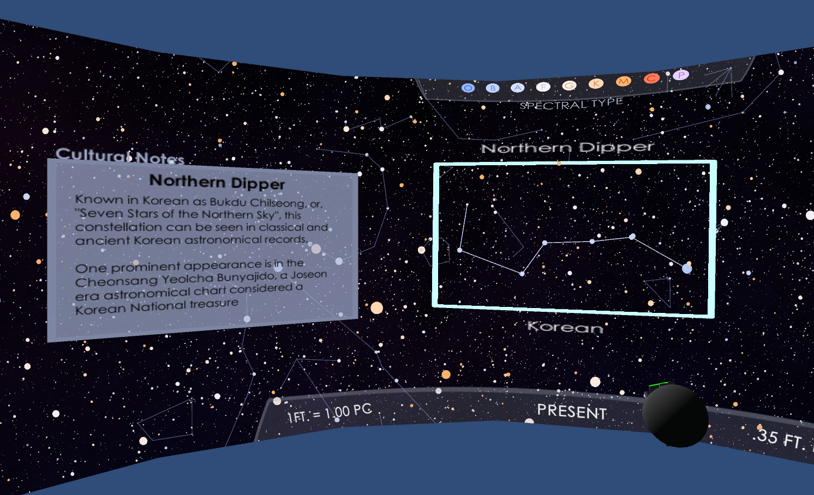
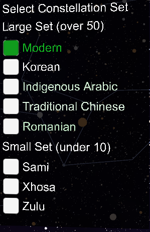

# Immersive Stars and Skycultures - Features

## Basic Controls

In the CAVE2: Open menu with "O" Button, close with "X" button. 
On desktop: Open menu with right click, close with left click. 

The first major control feature is the **Action Modes**. These modes alter the behavior of the d-pad on the CAVE2, or the ZXCV keys on desktop. 

1. Time 
The Time mode allows the user to either step forwards and backwards in time. 
* Left/Z : Backwards 500 years
* Right/X: Fowards 500 years
* Up/C: Play steps in sequence in the direction last pressed
* Down/V: Pause time series

2. Scale 
The Scale mode allows the user to change how many parsecs map to one foot of physical space. 
* Left/Z : Decrease parsec
* Right/X: Increase parsec
* Up/C: Switch between feet and parsecs for the "Distance from Sol" display units
* Down/V: Reset scale to 1ft. = 1pc.

3. Constellation Highlight 
This mode highlights a specific constellation in the visualized set by brightening the lines, as well as providing an information panel with the name of the constellation. 
* Left/Z : Decrement highlighted constellation number
* Right/X: Increment highlighted constellation number
* X(CAVE2 Button 3)/Point-and-Click: Drag highlight panel

4. Big Dipper Spotlight 
The Big Dipper Spotlight focuses on the Big Dipper asterism, showing the different skycultures it appears in with some additional information and background. 
* Up/C: Cycle through skycultures
* Down/V: Jump to ideal viewing angle

5. Quick Actions 
Quick Actions can be selected as the main control mode, or they can be accessed by holding the **L1/M** button. 
* Left/Z : Toggle constellation lines
* Right/X: Toggle GUI elements
* Up/C: Reset player position
* Down/V: Switch star color scale between spectral type and exoplanet number. 

Aside from the Action Modes, users may switch between constellation sets. Featured skycultures include:
1. Modern
2. Korean
3. Indigenous Arabic
4. Traditional Chinese
5. Romanian
6. Sami
7. Xhosa
8. Zulu

The application also allows for "free-flying" navigation. On Desktop, this is achieved with the mouse direction and the WASD keys. On the CAVE2, users navigate by holding the L2 button and pushing the wand in the desired direction of flight. 

[App Features](app_usage.md) • [Data, Processing, and Sources](data.md) • [Code](code_and_build_instructions.md) • [Development Details](dev_details.md) • [Optimization Details](optimizations.md)
