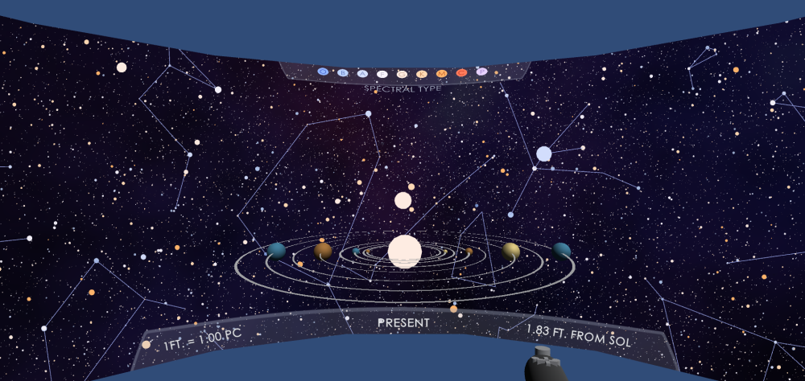

# Unity Application

The code for Immersive Stars and Skycultures is available [on GitHub.](https://github.com/halBRY/CS528-Project/tree/master)
* Select the `master` branch for building on desktop/CAVE2 simulator
* Select the `CAVE2-config` branch for building for the CAVE2

The Unity application uses the CAVE2 simulator from the [omicron-unity package](https://github.com/uic-evl/omicron-unity). To run the application, you will need to use Unity version 2019.2.11f1. The GitHub repository should already contain the necessary packages (omicron-unity, Multiplayer HLAPI, and TextMeshPro). If, when the project is opened, there are compiler errors, double check that Multiplayer HLAPI and TextMeshPro are installed by checking in the **Window > Package Manager**, and omicron-unity is present by checking for the drop-down at the top, shown below: 

To run, you will need to perform the following steps:
1. Clone the code in the CS528-Project repository
2. Make sure you have Unity version 2019.2.11f1. Then you can add the CS528-Project folder as a Unity project and open in the editor. 
3. If it is not added automatically, navigate to `/Assets/Scenes`, and drag the "starScene" into the hierarchy. 
4. (Mac Only) If you are using Mac, you will not be able to run the code if your graphics API is set to Metal. In the Unity editor, open the player settings in **Edit > Project Settings > Player > Other Settings**. Find the "Auto Graphics API for Mac" checkbox, uncheck it, and switch your graphics API to **OpenGL**. 
    * You can find more information about enabling OpenGL in the [Unity docs](https://docs.unity3d.com/Manual/OpenGLCoreDetails.html).

In the Unity Editor, the application looks like the image below, with spheres generated by a geometry shader at runtime.

If you wish to change the music playing in the background, you can add new music to the `/Assets/Scenes` folder, then drag it into the AudioSource component of the PlayerController, as shown below: 

## Scene Details
There are three main GameObjects that control the visualization. 
1. Stars
    * The `Stars` GameObject runs the `PointCloudCustomVertData.cs` script. This Script reads in the star data from the CSV file in `/Assets/Resources` and creates a Mesh object with all the necessary vertex data. This includes the (x,y,z) position, the (vx,vy,vz) for velocity, and the color and radius details. 
2. Constellations
    * The `Constellations` GameObject runs the `DrawLinksAsMesh.cs` script. This script reads in a selected constellation file and constellation name file. Similar to the `Stars` object, it passes (x,y,z) and (vx,vy,vz) to the shader program. 
3. App Manager
    * The App Manager handles the user input, switching of action modes, and the switching of constellation sets. 

## Shaders
In `/Assets/Shaders`, the `PointCloudDisk.shader` shader contains the code to draw the stars. This shader program reads in the vertex data sent from the Mesh created in `PointCloudCustomVertData.cs`. There, it applies transoformations to get the stars in the right place, at the right scale, at the right time. These vertexes are passed to a geometry shader where a sphere is drawn at each point. Finally, the spheres are colored by either spectral type of exoplanet number, and are darkened the farther the camera is from their base point. 

## UI Elements
In In `/Assets/Textures`, there are several custom UI elements. There PNG textures were created in Clip Studio Paint. 