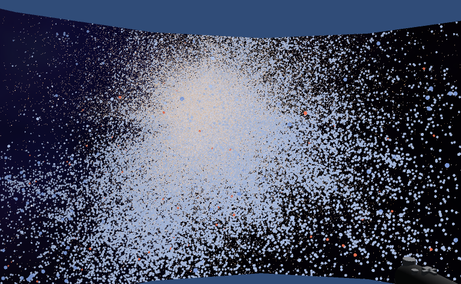
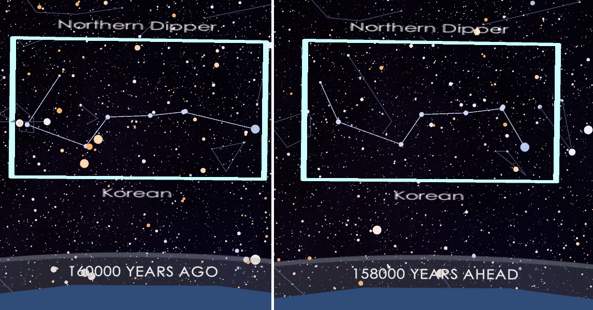

# Interesting Findings

## Data
One interesting part of the data preprocessing and processing was the non-Harvard Classification spectral types. It took a decent amount of time to understand what all these different types were, and how to (at least somewhat) accurately handle them. 

## Stars

When examining the stars using the shift in scale, I found it interesting to pull back and examine the shape of the whole point cloud. An interesting observation from this is that, at the edges, the majority of the recorded stars are of the A, B, O, and D classes, meaning they are very large or very dense, and very hot. I can't help but wonder what the reason is for this pattern.  

## Constellations

Using the cConstellation highlight and time features, it was interesting to observe how some constellations change over time. I particularly found the changes in the Big Dipper interesting, as it is a very prominent Northern Hemisphere constellation. Shown above, at the 160,000 years ago mark, it is noticably different today. I find it interesting to observe that this visible different exists within the span of time of Human existence. 

## Skycultures
Initially, I had hoped to do my constellation spotlight feature on specifically Korean constellations. However, specific information about Korean constellations proved incredibly difficult to find. I ended up finding [this paper](https://www.researchgate.net/publication/343501962_Rediscovering_Korea's_Ancient_Skies_An_Immersive_Interactive_3D_Map_of_Traditional_Korean_Constellations_in_the_Milky_Way), which created a very similar sort of project to what was planned here. I couldn't find any video or demo of their project, unfortunately. However, it is also interesting in this paper that they discuss the difficulty in finding information about traditional Korean constellations, particularly those seen in the Cheonsang Yeolcha Bunyajido. The authors of this paper specifically call out the unverifiable nature of the Stellarium constellations, as they are sourced by a single person who has proved unreachable. 

[App Features](app_usage.md) • [Data, Processing, and Sources](data.md) • [Code](code_and_build_instructions.md) • [Development Details](dev_details.md) • [Optimization Details](optimizations.md)
