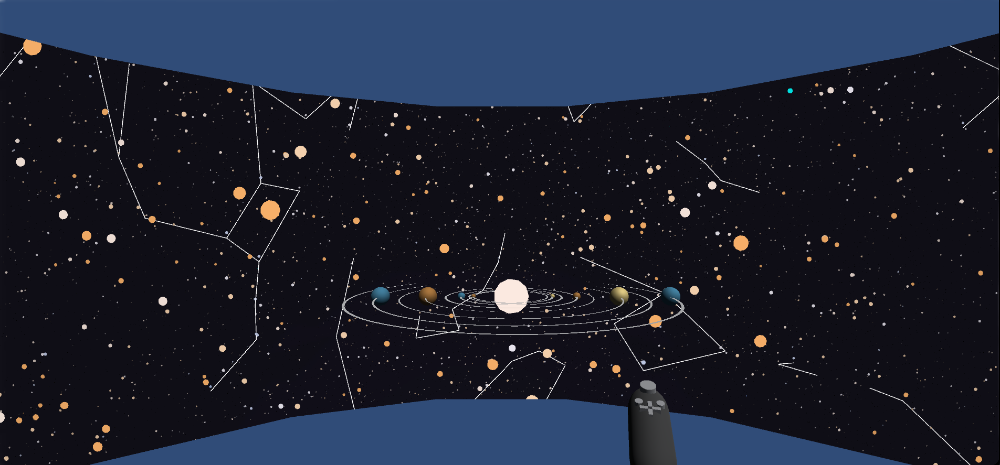

# CS528 VR Project

Project by Hal Brynteson. 

## Overview

For this project, the goal is to visualize stars and associated constellations in the CAVE2 using Unity3D. 
* The GitHub with the Unity Project can be found [here](https://github.com/halBRY/CS528-Project)
* A video of the project working in the Unity Editor can be found [here](https://drive.google.com/file/d/1CRULddfhGBJ3oyMP_4fFgXRbFawCzfJK/view?usp=sharing)

## Data and Data Preprocessing

The data for the stars, their locations, their spectral types, and other information is found [here](https://github.com/astronexus/ATHYG-Database/tree/main/data/subsets). Data to link stars into constellations is found [here](https://github.com/Stellarium/stellarium/tree/master/skycultures/modern).

Preprocessing for the data was done in R. You can access the R scripts [here](https://github.com/halBRY/CS528-Docs/tree/main/DataPreprocessing). Generally, the following processing was done:
* Drop stars without a spectral type, or (x,y,z) coordinate.
* Calculate the (x,y,z) coordinate in "feet".
    * The (x,y,z) coords in the data are given in parsecs. If a parsec maps to one meter in Unity units, here the parsecs are treated as meters, and converted as such. 
* Calculate a "luminance" of each star based on its apparent magnitude. 
* Create a "constellations.txt" file that replaces the hip IDs in from Stellarium's constalltion data with the (x,y,z) coordinates.

The processed data files are placed in the Unity project in the /Assets/Data folder. 

## Unity Application

The Unity application uses the CAVE2 simulator from the omicron-unity package. To run the application, you will need to use Unity version 2019.2.11f1, and will need to have the omicron pack installed and configued correctly (with all the dependent packages).

In the Unity Editor, the application looks like the image below, with spheres generated by a geometry shader at runtime. The spheres are sized and colored by their spectral type color, or shown as a set size and cyan if their spectral type was not part of the "OBAFGKM" scale. White lines show links between stars that create constellations. 